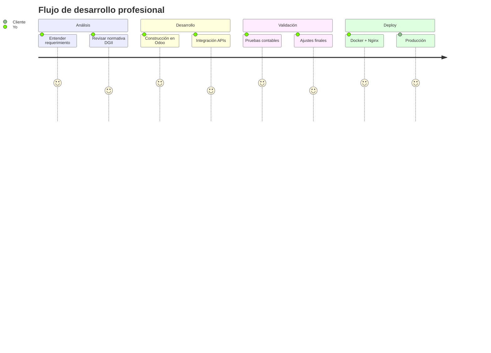
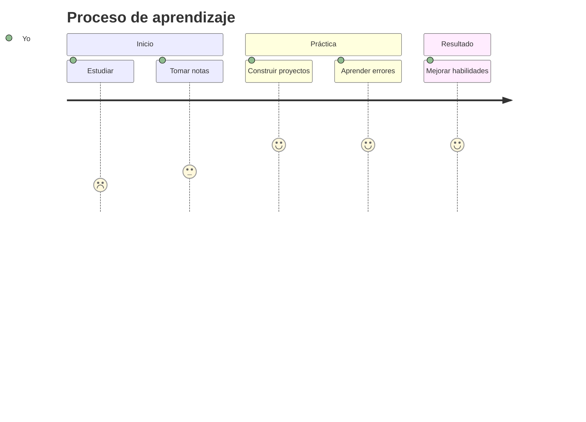

<p align="center">
  <svg xmlns="http://www.w3.org/2000/svg" width="900" height="120">
    <text x="50%" y="40%" dominant-baseline="middle" text-anchor="middle" font-size="28" font-family="Fira Code" font-weight="bold" fill="red">
      ¡Hey 👋! Soy ortizzzz4 💻
      <animate attributeName="fill" values="red;blue;green;orange;purple;red" dur="25s" repeatCount="indefinite" />
    </text>
    <text x="50%" y="80%" dominant-baseline="middle" text-anchor="middle" font-size="20" font-family="Fira Code" fill="blue">
      Desarrollador de software enfocado en soluciones empresariales y automatización contable con Odoo, Python y tecnologías modernas.
      <animate attributeName="fill" values="blue;purple;cyan;magenta;yellow;blue" dur="25s" repeatCount="indefinite" />
    </text>
  </svg>
</p>

---

## ♟️ Pensamiento estratégico

|   | A | B | C | D | E | F | G | H |
| - | - | - | - | - | - | - | - | - |
| 8 |  |  |  |  |  |  |  |  |
| 7 |  |  |  |  |  |  |  |  |
| 6 |  |  |  |  |  |  |  |  |
| 5 |  |  |  |  |  |  |  |  |
| 4 |  |  |  |  |  |  |  |  |
| 3 |  |  |  |  |  |  |  |  |
| 2 |  |  |  |  |  |  |  |  |
| 1 |  |  |  |  |  |  |  |  |

---

## 🚀 Sobre mí

- 👨‍💻 Especialista en desarrollo de módulos personalizados en **Odoo v15–v18**
- 🧾 Integración de **Factura Electrónica (DTE)** con cumplimiento DGII
- ⚙️ Automatización contable y generación de reportes
- 🌐 Desarrollo con **Vue.js + FastAPI + SQL Server**
- 🐙 Git + Docker + Deploy
- 🔄 Migración de versiones

---

## 🧠 Flujo de trabajo



---

## 🛠️ Tecnologías


---

## 📈 GitHub Stats

<p align="center">
  
  <br/>
  
</p>

---

## 💡 Proyectos

### 🧾 Facturación Electrónica en Odoo
- Validación tributaria  
- Firma digital y envío a DGII  
- Integración con ventas  
- Migración de versiones  

### 🌐 Plataforma contable
- Vue.js + FastAPI  
- SQL Server  
- Reportes y validaciones  

---

## 🧪 Mermaid



---

## 🔗 Portafolio

🌐 https://luisportafolio.pythonanywhere.com/

---

```javascript
const ortizzzz4 = {
  stack: [
    "Odoo",
    "Python",
    "FastAPI",
    "Vue.js",
    "SQL Server",
    "PostgreSQL",
    "Docker",
    "Git"
  ],
  area: "Contabilidad y automatización empresarial"
};
```

