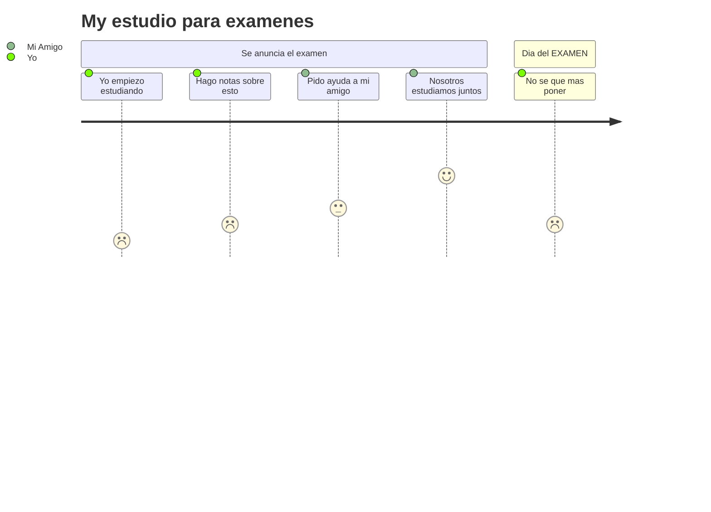

<p align="center">
  <svg xmlns="http://www.w3.org/2000/svg" width="900" height="120">
    <text x="50%" y="40%" dominant-baseline="middle" text-anchor="middle" font-size="28" font-family="Fira Code" font-weight="bold" fill="red">
      ¡Hey 👋! Soy ortizzzz4 💻
      <animate attributeName="fill" values="red;blue;green;orange;purple;red" dur="25s" repeatCount="indefinite" />
    </text>
    <text x="50%" y="80%" dominant-baseline="middle" text-anchor="middle" font-size="20" font-family="Fira Code" fill="blue">
      Desarrollador de software enfocado en soluciones empresariales y automatización contable con Odoo, Python y tecnologías modernas.
      <animate attributeName="fill" values="blue;purple;cyan;magenta;yellow;blue" dur="25s" repeatCount="indefinite" />
    </text>
  </svg>
</p>

---

|   | A | B | C | D | E | F | G | H |
| - | - | - | - | - | - | - | - | - |
| 8 |  |  |  |  |  |  |  |  |
| 7 |  |  |  |  |  |  |  |  |
| 6 |  |  |  |  |  |  |  |  |
| 5 |  |  |  |  |  |  |  |  |
| 4 |  |  |  |  |  |  |  |  |
| 3 |  |  |  |  |  |  |  |  |
| 2 |  |  |  |  |  |  |  |  |
| 1 |  |  |  |  |  |  |  |  |


---

### 🚀 Sobre mí

- 👨‍💻 Especialista en desarrollo de módulos personalizados en **Odoo v15–v18**, con foco en empresas del sector financiero, comercial y de servicios en **El Salvador**.
- 🧾 Integracio de **Factura Electrónica (DTE)** en Odoo con cumplimiento DGII.
- ⚙️ Automatización de procesos contables, generación de reportes PDF/XLSX, y desarrollo de flujos de validación tributaria.
- 🌐 Desarrollo de sistemas web con **Vue.js**, **FastAPI** y **SQL Server**, incluyendo punto de venta visual, catálogo contable y validaciones dinámicas.
- 🐙 Control de versiones con Git y despliegue en Docker.
- Migracion de diferentes versiones

---

### 🛠️ Tecnologías


---

<h2 align="center">📈 GitHub Stats</h2>

<p align="center">
  
  <br/>
  
</p>

<h2 align="center">🧠 Top Languages</h2>

<p align="center">
  
</p>
---

### 💡 Proyecto destacado: Factura Electrónica en Odoo

> Módulo para Odoo v16 para emisión de **Comprobantes Electrónicos (DTE),Entre otros**:  
> ✅ Validación tributaria  
> ✅ Firma digital y envío a la DGII  
> ✅ Integración con ventas y punto de venta  
> ✅ Migracion de versiones
> ✅ Configuracion de On-Premise
### 💡 Proyecto destacado: Plataforma contable con Vue + FastAPI

> Sistema contable web desarrollado con:
> - **Vue.js**: Interfaz dinámica con vista espejo para POS  
> - **FastAPI**: API backend con lógica financiera avanzada  
> - **SQL Server**: Modelo contable basado en normativas de El Salvador  
> - Funciones: registro contable, carga de archivos, validaciones, reportes

---
# Herramientas integradas en github
Herramientas que github implementa en su markdown para crear elementos visuales

## Mermaid



### 🔗 Portafolio

🌐 [luisportafolio.pythonanywhere.com](https://luisportafolio.pythonanywhere.com/)

---

```javascript
const ortizzzz4 = {
  stack: [
    "Odoo",
    "Python",
    "FastAPI",
    "Vue.js",
    "SQL Server",
    "PostgreSQL",
    "Docker",
    "Git"
  ],
  area: "Contabilidad, automatización de procesos y sistemas administrativos"
};


